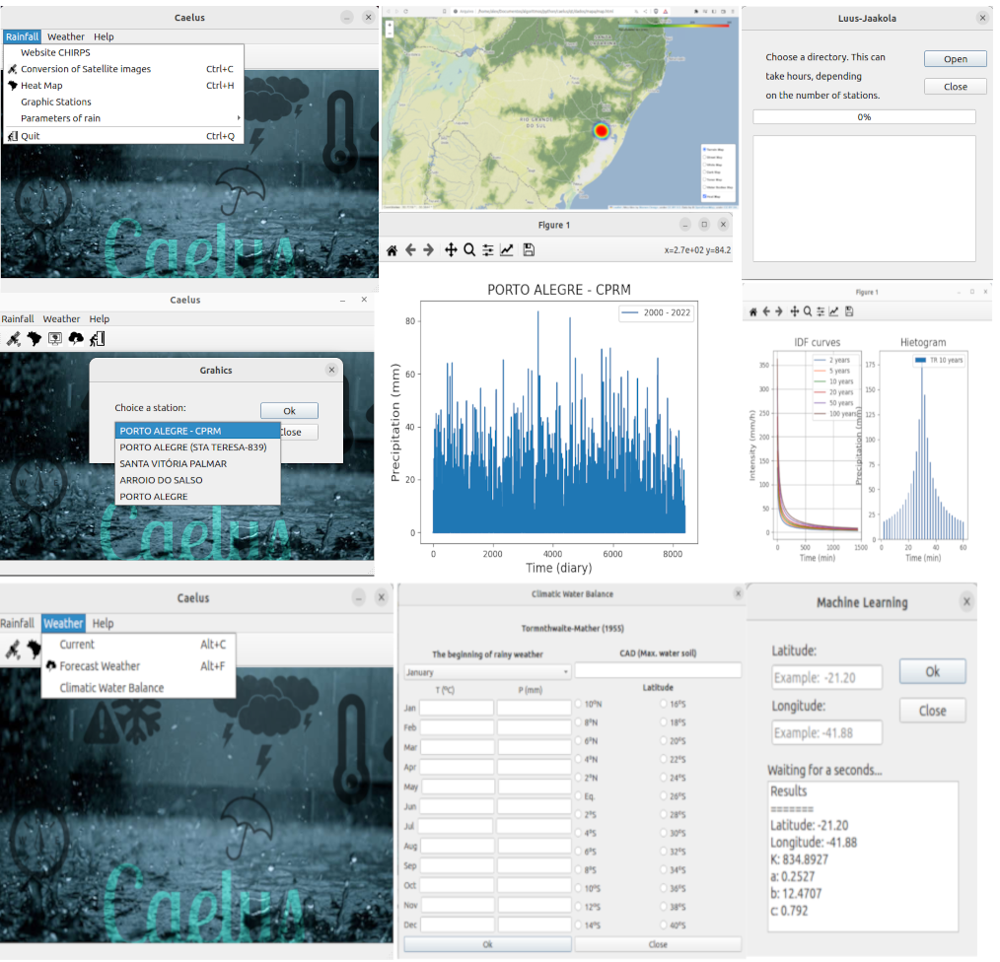

<h1>
Caelus
</h1>

  <h2>About this project</h2>
  This project originated as a doctoral thesis in the Modeling and Technology for Environmental applied in Water Resources at the Federal Institute of Fluminense at the end of 2020. This software uses the Python programming language, PyQt library, artificial intelligence, and optimization methods to predict parameters of the intense rainfall equation.

  <h2>Why?</h2>
  The idea of this project is to use software to assist in city management against extreme rainfall events, mitigating the problems caused by them.

